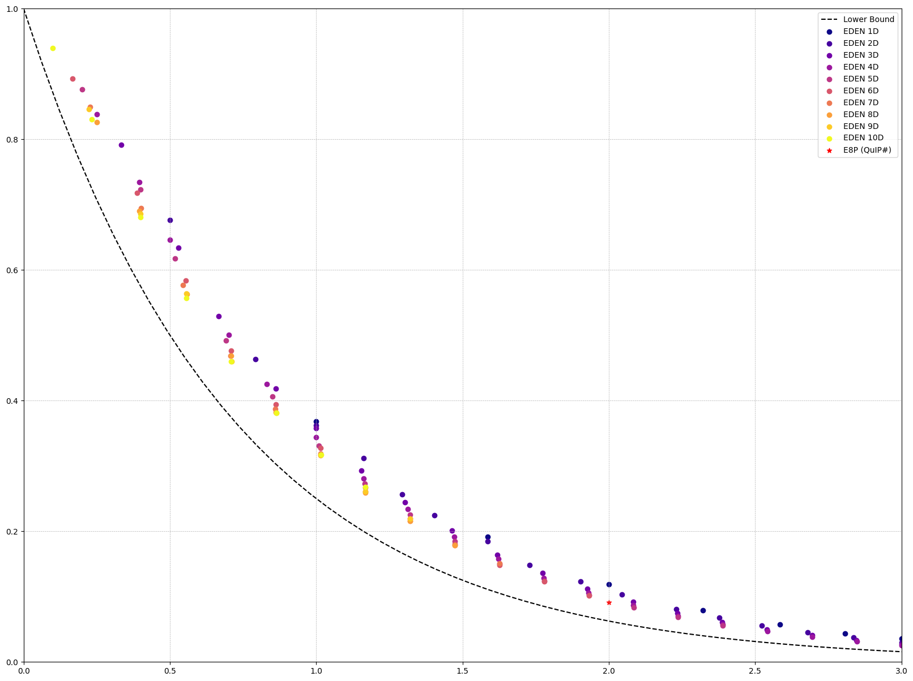

## What we have now

## Numerical estimations for different dimensionality grids for compressing the Gaussian distribution

### Estimate optimal grids

Run `nd_eden.ipynb` to produce grid estimations via stochastic EM algorithm.

### Estimate MSE

Run `edenn.ipynb` to estimate and plot MSE.

